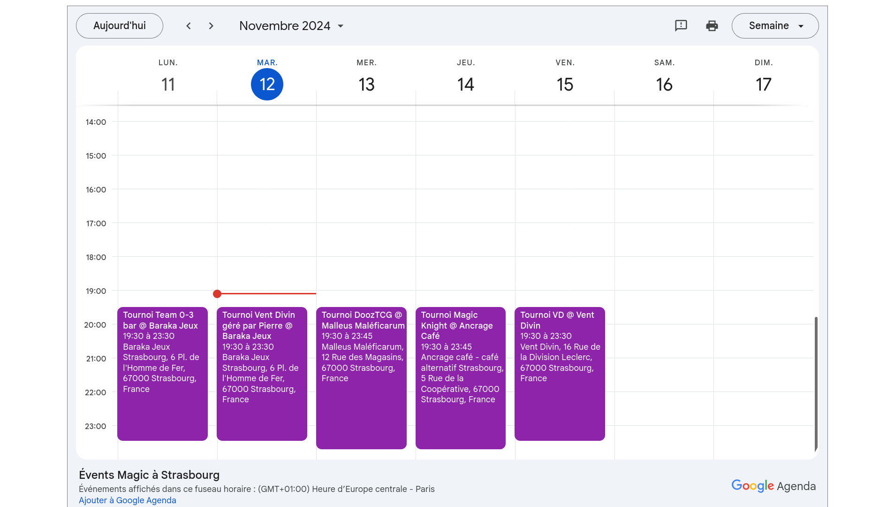

# 📅 Events Magic à Strasbourg

> Agenda partagé en ligne (Google Agenda) des tournois et événements **Magic: the Gathering** à Strasbourg, maintenu bénévolement par [Lilian (Naereen)](https://github.com/Naereen).

La plupart des événements Magic à Strasbourg sont réguliers : ce calendrier Google public a pour but de les répertorier, et de vous permettre de les ajouter à votre propre agenda (Google Agenda ou toute application compatible iCal).

> **Note importante :** cet agenda est maintenu bénévolement et peut ne pas être exhaustif ou parfaitement à jour. Pour les informations les plus précises, veuillez consulter directement les boutiques ou associations organisatrices.

---

## 🌐 Site web et aperçu

📌 **Page web officielle :** <https://naereen.github.io/Events-Magic-Strasbourg/>

---

## 📥 S'abonner à l'agenda

### 1. Google Agenda

Cliquez sur ce lien pour ajouter l'agenda directement à votre Google Agenda :

👉 [S'abonner via Google Agenda](https://calendar.google.com/calendar/u/0?cid=NDdmNzk0ZmQzMTEwYWYzOWI1NGEyYWFkZGQ0MjcwZDY0MTQyZTk4OGFjZDU4OGYyZGIwNGMwNWFjMTA1NGFhN0Bncm91cC5jYWxlbmRhci5nb29nbGUuY29t)

### 2. Autre application (format iCal)

L'agenda est disponible au format iCal (compatible avec Thunderbird, Apple Calendar, Outlook, etc.) à cette adresse :

📥 [Télécharger le fichier `.ics`](https://calendar.google.com/calendar/ical/47f794fd3110af39b54a2aaddd4270d64142e988acd588f2db04c05ac1054aa7%40group.calendar.google.com/public/basic.ics)

Pour apprendre comment s'abonner à un agenda iCal dans votre application, vous pouvez consulter :
- [Aide Google Agenda](https://support.google.com/calendar/answer/37083?hl=fr)
- [Recherche DuckDuckGo](https://duckduckgo.com/?q=comment+s%27abonner+%C3%A0+un+agenda+au+format+iCal&ia=web)

---

## 🗺️ Le paysage Magic: the Gathering à Strasbourg

### Organisateurs hebdomadaires

- **[Vent Divin](https://www.ventdivin.com/content/11-calendrier-des-evenements)** — boutique Magic organisant des événements chaque mardi soir (au [bar Baraka Jeux](https://barakajeuxstrasbourg.fr/), 5 € de PAF, sans inscription : Pauper, Duel Commander, Modern, EDH) et quasiment chaque vendredi soir (à la boutique, ~9 € sur inscription : Duel Commander, Legacy/Pre-Modern, Modern/Standard, EDH, drafts).

- **[Dooz TCG](https://www.cardmarket.com/fr/Magic/Users/Dooz-TCG)** — boutique spécialisée en cartes à l'unité, avec des événements chaque mercredi soir au [Malleus Maleficarum](https://www.doozescape.com/bars-a-jeux/malleus-maleficarum) (8,50 € petite boisson incluse, sans inscription : Duel Commander, Modern/Standard, EDH, drafts). Parfois des gros tournois le dimanche et des Avant-Premières.

- **[All-in TCG](https://www.cardmarket.com/fr/Magic/Users/All-In-TCG)** — organise des soirées quasiment chaque lundi et jeudi au [bar Baraka Jeux](https://barakajeuxstrasbourg.fr/) (5 €, sur inscription via Discord : Pauper, Duel Commander, Primordial, Modern, EDH).

- **[Association Cartes Flambées](https://www.helloasso.com/associations/cartes-flambees)** — EDH Commander multi chaque premier mercredi du mois (Maison des Jeux de Strasbourg), et d'autres formats les jeudis soirs (salle CSL, près du Musée Vaudou), 19h30–23h30.

### Organisateurs mensuels

- **[Philibert](https://www.philibertnet.com/fr/120-magic-l-assemblee)** — après-midis Magic mensuelles les samedis (14h–19h, [Philibar](https://www.philibar.net/)), format EDH Commander multi, gratuit ou 3 €, sur inscription via EventBrite.

- **[Arpenteurs de Strasbourg](https://arpenteursdestrasbourg.netlib.re/)** — association organisant des drafts à Dooz TCG / Malleus Maleficarum ou à [la Plage Digitale](https://www.laplagedigitale.fr/). Retrouvez-les sur [Discord](https://disboard.org/fr/server/512327166256742400) ou [Facebook](https://www.facebook.com/people/Arpenteurs-de-Strasbourg/100073644942712/).

### Événements et conventions récurrents

- **[Fumble Corp. l'Assemblée](https://mtg.fumblecorp.com/)** — convention bi-annuelle dédiée à l'EDH Commander multi, rassemblant plus d'une centaine de joueuses et joueurs sur deux jours.

- **[Legendary Tournament Commander (LTC)](https://linktr.ee/LTC67)** — convention bi-annuelle (mars/avril et octobre), dont la 12e édition est prévue les 17-18 octobre 2026. Championnat Régional d'Alsace au format Duel Commander en mars/avril.

- **[Don des Dragons](https://www.dondesdragons.org/)** — festival annuel (fin octobre/novembre) autour des jeux de rôle et jeux en général. L'association des Arpenteurs de Strasbourg y tient un stand pour de l'initiation Magic, des drafts et du jeu libre.

- **CorpF** — boutique d'Ostwald (sud de Strasbourg) organisant un à deux grands weekends de tournois par an, au format Duel Commander.

### Formats joués à Strasbourg

À Strasbourg, les formats les plus courants sont l'**EDH Commander multi**, le **Modern**, le **Pauper** (avec la [Ligue Pauper Strasbourg](https://www.pauper-france.fr/LPStrasbourg)), le **Duel Commander**, un peu le **Legacy** et le **Standard**.

### Avant-Premières

Les boutiques **Vent Divin** et **Dooz TCG** proposent généralement 2 à 5 tournois d'Avant-Première chaque weekend d'A-P. Le **TOTEM CAFE** à Schiltigheim en propose généralement une le samedi soir, et **Philibert** en organise une en Troll-à-deux-têtes le mercredi suivant.

### Ressources externes

- [Locator Wizards of the Coast](https://locator.wizards.com/) — pour trouver les boutiques et événements officiels.
- [Spicerack.gg – événements near Strasbourg](https://www.spicerack.gg/events?formats=&eventTypes=&rulesEnforcementLevels=&numMiles=30&numDays=180&latitude=48.5734053&longitude=7.752111299999999&selectedStores=&selectedStates=&page_size=25) — agenda communautaire.

---

## 🤝 Comment contribuer ?

Vous organisez un événement Magic à Strasbourg (ou aux alentours) et souhaitez le voir apparaître dans l'agenda ? Vous avez repéré une erreur ou une information manquante ? Plusieurs façons de contribuer :

- 💬 Contacter **Lilian (Naereen)** sur un des Discords Magic à Strasbourg (par exemple [celui des Arpenteurs de Strasbourg](https://disboard.org/server/512327166256742400)), ou par email : [naereen[@]crans.org](mailto:naereen@crans.org).
- 🐛 [Ouvrir un ticket (issue) sur GitHub](https://github.com/Naereen/Events-Magic-Strasbourg/issues).
- 🔀 [Proposer une Pull Request](https://github.com/Naereen/Events-Magic-Strasbourg/pulls) avec vos modifications directement.

Toute contribution est la bienvenue pour rendre cet agenda plus complet et à jour pour toute la communauté Magic à Strasbourg !

> 💡 Pour organiser vos propres petites rencontres entre joueurs, rejoignez le Discord des Arpenteurs et utilisez le canal `#organiser-vos-rencontres`.

---

## :scroll: Licence ? 

[Licence MIT](https://lbesson.mit-license.org/) (fichier [LICENSE](LICENSE)).
© [Lilian Besson](https://GitHub.com/Naereen), 2024–2026.

